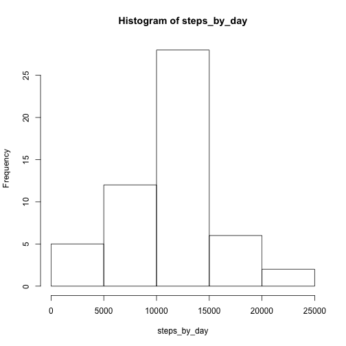
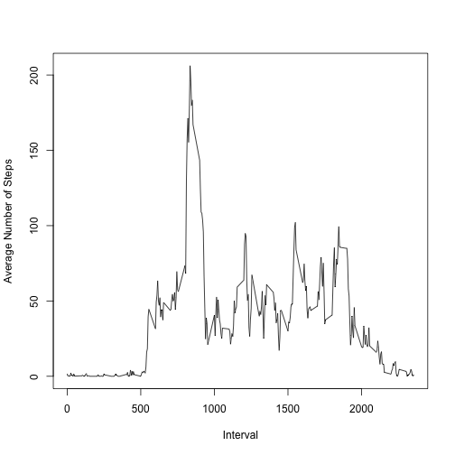
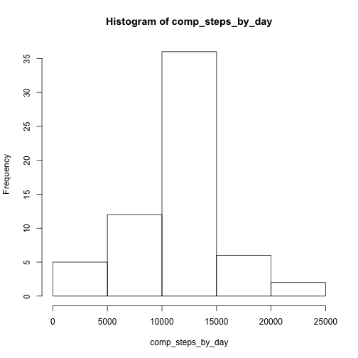
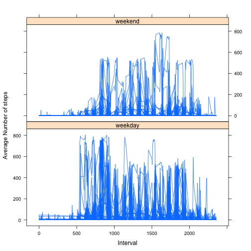

## Loading and preprocessing the data

```r
data <- read.csv("activity.csv", stringsAsFactors = FALSE)
```

## What is mean total number of steps taken per day?

```r
steps_by_day <- tapply(data$steps, factor(data$date), sum)
hist(steps_by_day)
```

 

```r
mean <- mean(steps_by_day, na.rm = TRUE)
med <- median(steps_by_day, na.rm = TRUE)
output <- paste("Mean: ", mean, "  Median: ", med)
output
```

```
## [1] "Mean:  10766.1886792453   Median:  10765"
```

## What is the average daily activity pattern?

```r
no_na_data <- data[!is.na(data$steps), ]
steps_per_interval = tapply(no_na_data$steps, factor(no_na_data$interval), mean)
plot(names(steps_per_interval), steps_per_interval, type = "l", 
     xlab = "Interval", ylab = "Average Number of Steps")
```

 

```r
max_int <- names(steps_per_interval)[steps_per_interval == max(steps_per_interval)]
max <- max(steps_per_interval)

output <- paste("Interval", max_int, "has the largest average of steps =", max)
output
```

```
## [1] "Interval 835 has the largest average of steps = 206.169811320755"
```

## Imputing missing values

```r
empty <- data[is.na(data$steps), ]
output1 <- paste("Number of rows with missing values:", nrow(empty))
print(output1)
```

```
## [1] "Number of rows with missing values: 2304"
```

```r
for(i in 1:nrow(empty)) {
  empty[i, 1] = steps_per_interval[[as.character(empty[i, 3])]]
}
complete <- data.frame(rbind(no_na_data, empty))


comp_steps_by_day <- tapply(complete$steps, complete$date, sum)
hist(comp_steps_by_day)
```

 

```r
mean <- mean(comp_steps_by_day)
med <- median(comp_steps_by_day)
output <- paste("Mean: ", mean, "  Median: ", med)
output
```

```
## [1] "Mean:  10766.1886792453   Median:  10766.1886792453"
```

These mean and median are very similar to the original since I supplemented the missing values with the average for each interval across that day. However, the total number of steps per day increased, because new values were being counted. We can now see how pronounced the range of 10000 to 15000 really is relative to the other levels.

## Are there differences in activity patterns between weekdays and weekends?

```r
week_stat <- weekdays(as.Date(complete$date)) == "Sunday" |
                         weekdays(as.Date(complete$date)) == "Saturday"
date_factor = character()
for(bool in week_stat) {
  if(bool) date_factor <- c(date_factor, "weekend")
  else date_factor <- c(date_factor, "weekday")
}
date_factor <- factor(date_factor)

library(lattice)

xyplot(steps ~ interval|date_factor, data = complete, type = "l", 
       xlab = "Interval", ylab = "Average Number of steps", layout=c(1,2))
```

 


